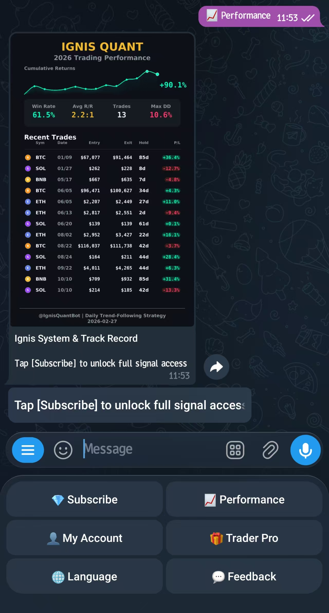
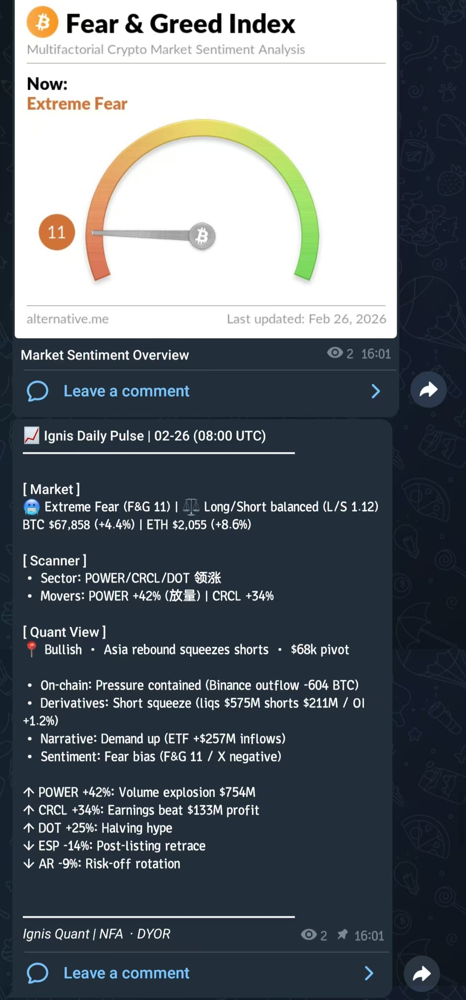
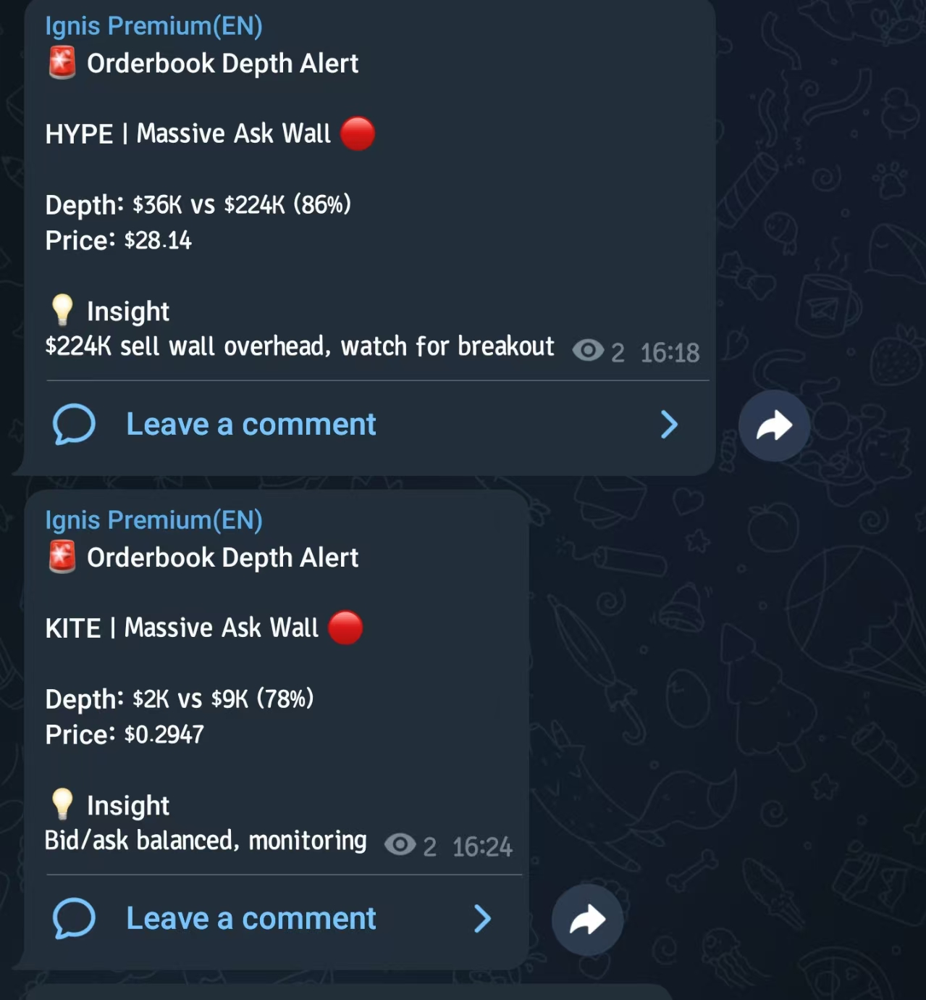
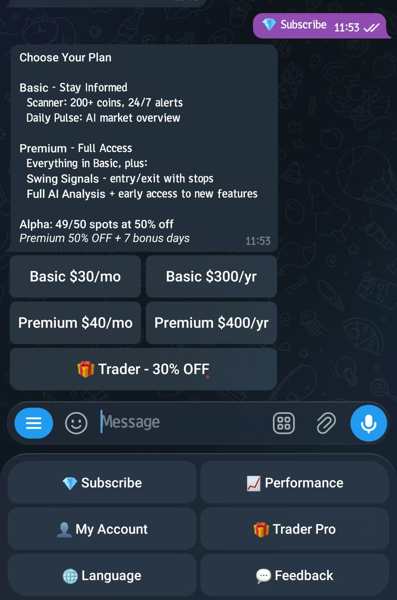

<div align="center">

# Ignis

**Crypto quantitative signal system built on academic trend-following research**

[](https://www.python.org/)
[](LICENSE)
[](https://docs.docker.com/compose/)
[](https://github.com/73nuts/crypto-signal-bot/actions)

> **Disclaimer**: This software is for educational and research purposes only. Cryptocurrency trading involves substantial risk of loss. Past performance does not guarantee future results. Use at your own risk.

</div>

---

Ignis detects trend-following entry signals on BTC, ETH, BNB, and SOL daily, executes trades automatically via Binance Futures, and delivers signals to subscribers through a Telegram bot with on-chain USDT payment.

<p align="center">
  
</p>

<table>
  <tr>
    <td width="33%" align="center">
      
      <br /><b>Daily Pulse</b>
      <br />AI-generated market summary
    </td>
    <td width="33%" align="center">
      
      <br /><b>Scanner Alerts</b>
      <br />Real-time orderbook depth monitoring
    </td>
    <td width="33%" align="center">
      
      <br /><b>Telegram Bot</b>
      <br />Subscription and signal delivery
    </td>
  </tr>
</table>

---

## Features

**Swing Strategy**
- Daily trend-following on BTC, ETH, BNB, SOL (USDT perpetual futures)
- Multi-period Donchian channel ensemble entry, ATR-based position sizing
- Trailing stop-loss exit (N-day low tracking)
- Backtested 2020-2025: 50% win rate, 3.18:1 profit factor, 10.6% max drawdown
- Academic basis: Swiss Finance Institute (2025), QuantPedia trend-following research

**Scanner**
- Real-time monitoring of 200+ coins every 3 minutes
- Volatility alerts (Z-Score > 2.5, price move > 3% / 5 min)
- Spread monitoring and orderbook imbalance detection
- Daily Pulse: AI-generated market summary (Grok)

**Telegram Bot**
- Subscription management with BSC on-chain USDT payment
- Automatic member activation after payment confirmation
- Signal delivery to Basic and Premium channels (EN + CN)
- Admin commands for operations and user management

**Infrastructure**
- DI container with protocol-driven dependency injection
- Saga orchestrator for distributed transactions (retry, compensation, idempotency)
- MessageBus for event-driven module decoupling
- Redis cache layer, MySQL persistence, Docker Compose deployment

---

## Quick Start

**Prerequisites**: Docker, Docker Compose, Binance Futures API key, Telegram bot token

**1. Clone and configure**

```bash
git clone https://github.com/73nuts/crypto-signal-bot.git
cd crypto-signal-bot
cp .env.example .env
cp .env.telegram.example .env.telegram
# Edit .env: fill in Binance API, MySQL/Redis passwords
# Edit .env.telegram: fill in Telegram bot tokens and channel IDs
```

**2. Start services**

```bash
docker-compose up -d mysql redis
# Wait for MySQL health check to pass, then start application services
docker-compose up -d swing scanner tg-bot tg-payment
```

**3. Verify**

```bash
docker-compose logs -f swing
docker-compose logs -f scanner
```

<details>
<summary><b>Manual controls (requires local Python 3.11+)</b></summary>

```bash
# Check scheduler status
python -m src.strategies.swing.scheduler --status

# Force a signal check immediately (testnet by default — safe)
python -m src.strategies.swing.scheduler --run-now

# Test entry signal for a specific symbol
python -m src.strategies.swing.scheduler --test-entry BTC
```

**About `--testnet`**: The scheduler runs against the Binance Futures testnet by default. Remove this flag only when you intend to trade with real funds.

**About `ENABLE_AUTO_TRADING`**: Set to `true` in `.env` to allow real order execution. Default `false` generates signals only.

</details>

---

## Architecture


| Container | Role |
|---|---|
| swing | Daily strategy scheduler |
| scanner | Real-time market scanner |
| tg-bot | Telegram bot (aiogram 3.x) |
| tg-payment | BSC on-chain payment listener |
| mysql | Signal and position storage |
| redis | Price cache, deduplication |

```
Scheduler -> Saga Orchestrator -> Binance API -> Position DB -> Telegram notify
               |
               +-- retry (exponential backoff)
               +-- compensation (cancel order / close position on failure)
               +-- idempotency (signal_id dedup)
```

---

## Configuration

Copy both example environment files and fill in your credentials:

```bash
cp .env.example .env
cp .env.telegram.example .env.telegram
```

`.env` contains core system config: Binance API keys, MySQL/Redis credentials, and general runtime settings.
`.env.telegram` contains Telegram-specific config: bot tokens, channel IDs, and payment settings.
Some variables appear in both example files for reference; `.env.telegram` takes precedence for all Telegram-related vars.

See [`.env.example`](.env.example) for all available options.

| Variable | Description |
|---|---|
| `ENABLE_AUTO_TRADING` | `true` to place real orders; `false` (default) generates signals only |
| `USE_TESTNET` | `true` to use Binance Futures testnet (safe for development) |

Strategy parameters are controlled by `config_futures.yaml`. Create `config_futures.local.yaml` to override locally (git-ignored).

---

## Requirements

- Python 3.11+
- MySQL 8.0+
- Redis 6.0+
- 2 GB RAM, 1 GB disk

---

## Documentation

| Document | Description |
|---|---|
| [SYSTEM_SPEC.md](docs/SYSTEM_SPEC.md) | System overview and quick-link index |
| [ARCHITECTURE.md](docs/development/ARCHITECTURE.md) | Component design, DI, MessageBus, Saga |
| [SWING_STRATEGY.md](docs/analysis/SWING_STRATEGY.md) | Strategy definition, backtest data, academic basis |
| [SCANNER.md](docs/analysis/SCANNER.md) | Scanner alert logic and thresholds |
| [COMMANDS.md](docs/operations/COMMANDS.md) | Operational command reference |

---

## Running Tests

```bash
# Unit tests only — no external dependencies
make test-unit

# All tests (requires running MySQL)
make test
```

---

## Contributing

Pull requests are welcome. For significant changes, open an issue first to discuss.

See [CONTRIBUTING.md](CONTRIBUTING.md) for setup instructions and guidelines.

---

## License

[MIT](LICENSE)
