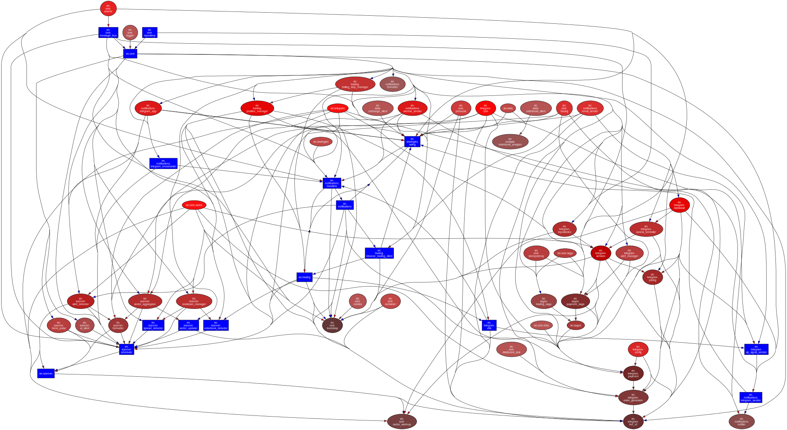

# Ignis Crypto Signal System

Crypto quantitative signal system - daily trend following + full-market intelligence scanning

> **New here?**: [System Specification (30-minute overview)](SYSTEM_SPEC.md)

## Architecture Overview

## Module Structure

| Module | Description |
|--------|-------------|
| [Core](api/core.md) | Infrastructure (DI, MessageBus, Saga, Cache) |
| [Trading](api/trading.md) | Trading module (Binance API, position management) |
| [Strategies](api/strategies.md) | Strategy layer (Swing daily strategy) |
| [Scanner](api/scanner.md) | Intelligence scanner |
